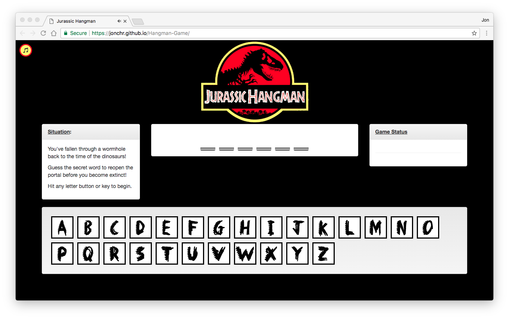
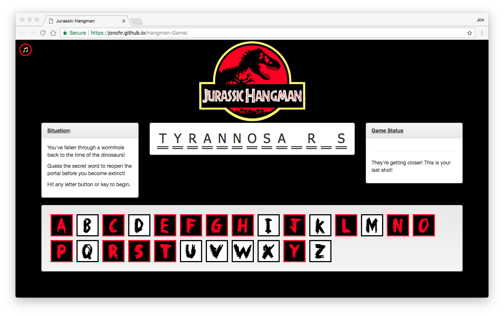

# Hangman-Game
A dinosaur-themed Hangman game demonstrating basic Bootstrap and Javascript. This app creates a static webpage containing the game. A live version can be found at: https://jonchr.github.io/Hangman-Game/

## Description

This game is a Jurassic themed Hangman game. Guess the secret word to win that round of the game. You have only nine incorrect attempts before you lose and the word is revealed. You can select letters either by clicking them on the page or pressing their keys on the keyboard. The theme music can be paused or started by pressing the music icon at the top left corner.

### Development

This game was developed as part of the GW Coding Bootcamp and was completed during the second week. This project was built using HTML5, CSS3 with Bootstrap 3.3.7, and plain Javascript.

Future Development Idea - add a themed drawing that shows the number of incorrect attempts equivalent to the scaffold in the usual game.

The Jurassic Hangman icon was created from the Jurassic Park logo with Jurassic Park font and edited in Photoshop.

Jurassic Park MIDI theme was cut using Audacity from the first 40 seconds of this video: https://www.youtube.com/watch?v=zuIVAV5VHIM

Jurassic Park font and Dinosaur font (used for the letter buttons) were downloaded from [Fonts2u.com].

### Organization

To run the game locally on your own computer, you can run the following in command line:

		git clone https://github.com/jonchr/Hangman-Game.git
		cd Hangman-Game
		open index.html

Upon cloning to your local machine, you can change the layout by editing index.html, the formatting in assets/css/style.css, or the functionality in assets/javascript/game.js.

## Screenshots
### The Hangman Game

### One Attempt Left - the music has been paused at the top left.

